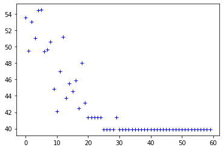

# ANT-TravellingSalesman

Solving the TSP problem using Ant Colony algorithm

## Output

Iteration ::  00 / BEST ::  53.54747490756563  
Iteration ::  10 / BEST ::  42.09433965819282  
Iteration ::  20 / BEST ::  41.38336283593860  
Iteration ::  30 / BEST ::  39.90070736983834  
Iteration ::  40 / BEST ::  39.90070736983834  
Iteration ::  50 / BEST ::  39.90070736983834  
Iteration ::  60 / BEST ::  39.90070736983834  

